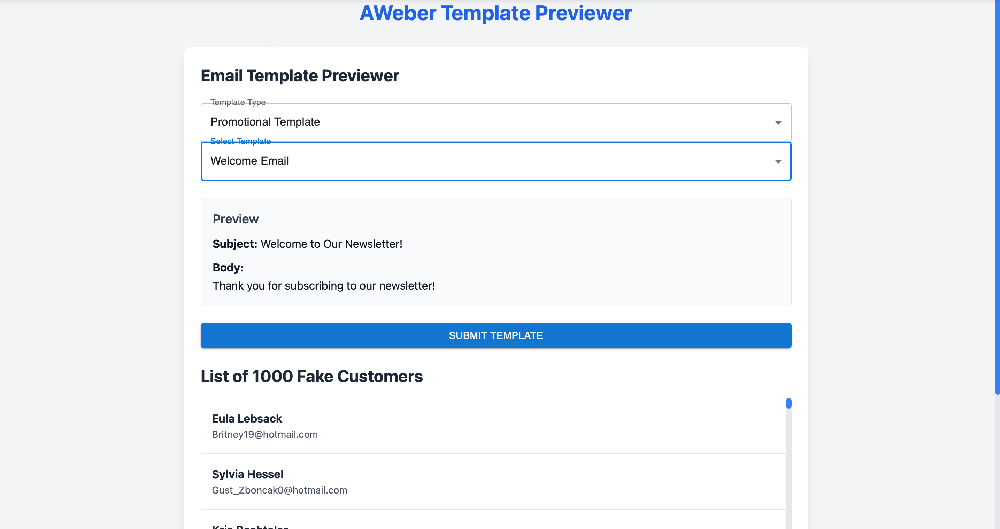
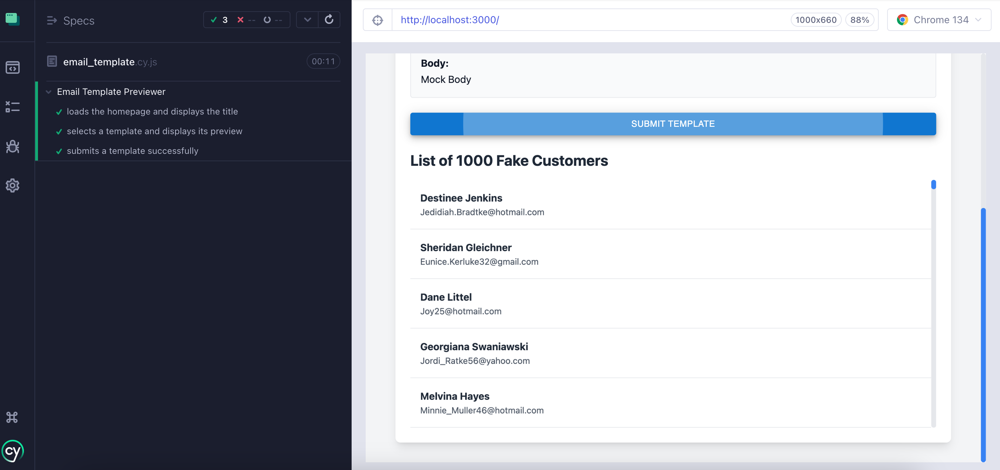

# AWeber Template Previewer

<div align="center">
  
  <br>
  <em>AWeber Home Screen</em>
  <br><br>
  
  <br>
  <em>AWeber Testing Example</em>
</div>

---

A React application designed to preview email templates and manage a list of customers.

## Table of Contents
- [Overview](#overview)
- [Technologies Used](#technologies-used)
- [Features](#features)
  - [Email Template Previewer](#email-template-previewer)
  - [Customer List](#customer-list)
  - [Form Submission](#form-submission)
  - [Notifications](#notifications)
- [Setup](#setup)
  - Clone the Repository
  - Install Dependencies
  - Start the Application
  - Using Automation Scripts
- [Testing](#testing)
  - [Unit Tests](#unit-tests)
  - [End-to-End Tests (Cypress)](#end-to-end-tests-cypress)
- [Test Fixtures](#test-fixtures)
- [Contributing](#contributing)
- [License](#license)


## Overview

This project showcases a modern frontend application built with React and TypeScript. It includes features such as:

- Email template previewing  
- Customer list management  
- Form submission simulation  

The application utilizes a mock API for data fetching and demonstrates efficient rendering of large lists using virtualization.

## Technologies Used

- **React**: For building the user interface and handling state changes.  
- **TypeScript**: Ensures type safety and maintainability throughout the codebase.  
- **Tailwind CSS**: Provides responsive styling and layout management.  
- **Material-UI**: Used for UI components like dropdowns and buttons.  
- **React Query**: Handles data fetching and caching from a mock API.  
- **json-server**: Simulates a backend API for testing purposes.  
- **Faker**: Generates fake customer data for demonstration.  
- **react-window**: Efficiently renders large lists of customers.  

## Features

### Email Template Previewer
Quickly select and preview email templates fetched from a mock API:
  - Dynamically updates subject lines and body content.
  - Supports multiple templates with varying designs.

### Customer List
Efficiently displays a list of up to 1000 fake customers using virtualization:
  - Smooth scrolling performance.
  - Search functionality (if implemented).

### Form Submission
Simulates submitting a selected template to a backend endpoint:
  - Handles both success and error responses gracefully.
  - Displays user-friendly notifications.

### Notifications
Provides visual feedback on form submission:
  - Success notifications for successful submissions.
  - Error alerts when submissions fail.

## Setup and Running the Application

### Prerequisites
Ensure you have the following installed on your system:
- **Node.js** (v14 or later)
- **npm** (v6 or later, which comes with Node.js)

Follow these steps to set up and run the application:

### Clone the repository:
```bash
git clone https://github.com/freedomwithin/aweber-template-previewer.git
```
Install dependencies:
```bash
npm install
````
Start the mock API server:
```BASH
json-server --watch db.json --port 3001
```
Start the React development server:
```bash
npm start
```
Open your browser and navigate to http://localhost:3000.

## Using Automation Scripts
To simplify the setup process, automation scripts are provided. These scripts automatically start both the mock API server and the React development server, then open the application in your default browser. This eliminates the need to run multiple commands manually.

## On macOS:
1. Use the .command script:
Double-click start-dev.command in Finder, or run it from Terminal:
```bash
./start-dev.command
```
## On Linux/Other Systems:
1. Use the .sh script:
Run the following command in Terminal:
```bash
./start-dev.sh
```
Both scripts will:
Start the mock API server on port 3001.
Start the React development server.
Automatically open http://localhost:3000 in your default browser.
Open your browser and navigate to http://localhost:3000.

## Testing

This project includes unit tests, integration tests, and end-to-end tests to ensure functionality and reliability.

Unit Tests (Jest & React Testing Library)
Unit tests are written for individual components to verify their behavior in isolation.

Running Unit Tests:
```bash
npm test
```

Example Tests:

1. TemplateSelector Component:
Verifies that templates are rendered correctly.
Ensures API calls fetch template data.
Handles edge cases, such as empty or invalid data.

2. CustomerList Component:
Ensures that the customer list displays correctly.
Tests virtualization for performance with large datasets.

End-to-End Tests (Cypress)
End-to-end tests simulate user interactions to verify that the entire application works as expected.
## Running Cypress Tests:

1. Open the Cypress Test Runner:
```bash
npx cypress open
```
2. Select a test file (e.g., email_template.cy.js) in the Cypress UI to run it interactively.

## Example End-to-End Tests:
1. Homepage Loading:
Verifies that the homepage loads successfully and displays the correct title.
2. Template Selection:
Simulates selecting an email template from the dropdown.
Verifies that the template preview is displayed correctly.
3. Form Submission:
Simulates submitting an email template.
Mocks API responses for success and error scenarios using fixtures (templates.json).
## Fixtures:
Fixtures are stored in cypress/fixtures to mock API responses during tests.

Example fixture file (templates.json):
```bash
[
  { "id": 1, "name": "Mock Template", "subject": "Mock Subject", "body": "<p>Mock Body</p>" },
  { "id": 2, "name": "Another Template", "subject": "Another Subject", "body": "<p>Another Body</p>" }
]
```
## Contributing

Contributions are welcome! Feel free to submit pull requests or report issues.

## License

This project is licensed under the [MIT License](https://opensource.org/licenses/MIT).